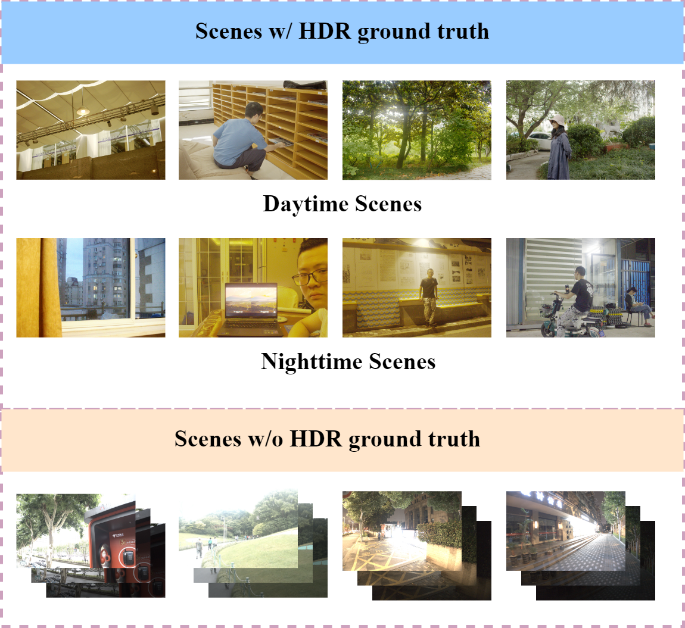

# RAW-DAWR
# RAW Domain High Dynamic Range Imaging with Supervised Motion Compensation and Wavelet Attention Refinement
### By [Junze Yang](https://github.com/Junze259), [Zihao Zhou](..), [Liquan Shen](..), [Zhaoyi Tian](..), [Xiangyu Hu](..), ###

## The RAW-domain HDR benchmark Dataset named RAW Diverse and Auxiliary HDR Dataset (RAW-DAHDR) 

    

## Download dataset
We provide the original raw data to facilitate the research on HDR RAW imaging. Since our dataset is collected from RAW domain, the data processing is highly flexible. The researchers can organize the RAW data according to their tasks to generate the desired datasets.

## Download dataset
Due to the large size of the data, the dataset is hosted on Baidu Netdisk. You can download it using the link below:

* **Baidu Netdisk Link:** [link](https://pan.baidu.com/s/1WeJEtVQ-iqMvlYsIqZKhAQ?pwd=abcd )
* **Extraction Code:** [abcd]

## Copyright
Our RAW-DAHDR dataset is available for the academic purpose only.
